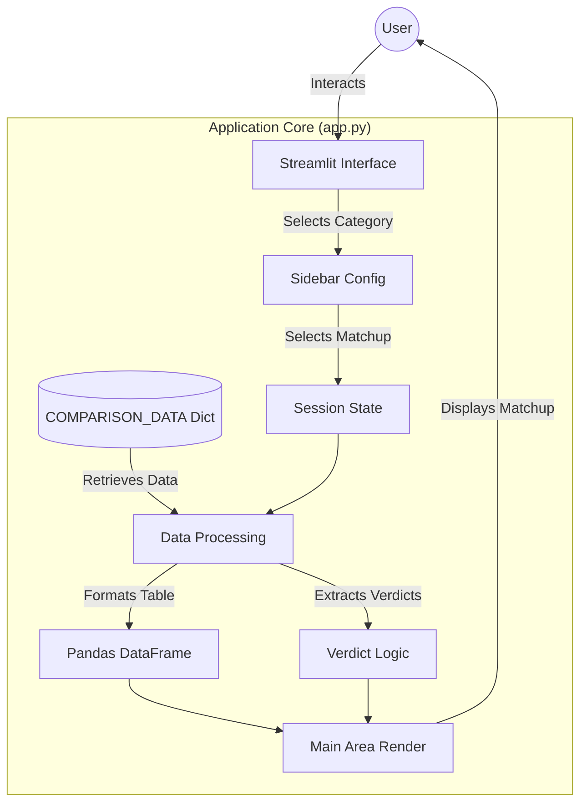
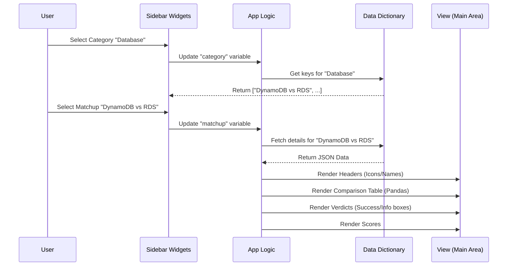

# 🏗️ Architecture Guide: The Tech Referee

This document outlines the technical architecture of **The Tech Referee**, a decision support tool built with Python and Streamlit.

## 🌟 System Overview

The Tech Referee is designed as a lightweight, single-page web application. It minimizes complexity by using a data-driven approach where comparison logic and content are decoupled from the UI rendering.

### Tech Stack

| Component | Technology | Purpose |
|-----------|------------|---------|
| **Frontend/UI** | [Streamlit](https://streamlit.io/) | Renders the interactive web interface. |
| **Logic** | Python 3.x | Handles data processing and flow control. |
| **Data Structure** | Python Dictionary | In-memory storage of tech comparison data. |
| **Analysis** | [Pandas](https://pandas.pydata.org/) | Creates structured comparison tables for display. |

## 📐 Application Architecture

The application follows a linear execution flow typical of Streamlit apps. Every user interaction re-runs the script from top to bottom, updating the state based on widget values.

## 🧩 Component Breakdown

### 1. Data Layer (`COMPARISON_DATA`)
The "database" is a nested Python dictionary located at the top of `app.py`. This ensures zero-latency lookups and easy modification without external database dependencies.

**Structure:**
*   **Level 1**: Category (e.g., "Cloud Compute")
*   **Level 2**: Matchup Key (e.g., "AWS Lambda vs EC2")
*   **Level 3**: Matchup Details (Options, Comparison Points, Verdicts, Scores)

### 2. The Sidebar Controller
The sidebar acts as the primary controller. It filters the dataset based on the user's selection:
1.  **Category Selector**: Filters the keys of the main dictionary.
2.  **Matchup Selector**: Populates based on the selected category.

### 3. The Comparison Engine
Once a matchup is selected, the engine:
*   Extracts the attributes (Cost, Scalability, etc.).
*   Constructs a `pandas.DataFrame` where rows are criteria and columns are the two technologies.
*   Renders this as a clean, interactive table.

### 4. The Verdict System
A conditional rendering system that displays:
*   **Option A Scenario**: When to choose the first tech.
*   **Option B Scenario**: When to choose the second tech.
*   **Scores**: Visualized using Streamlit metrics.

## 🔄 Data Flow detailed

