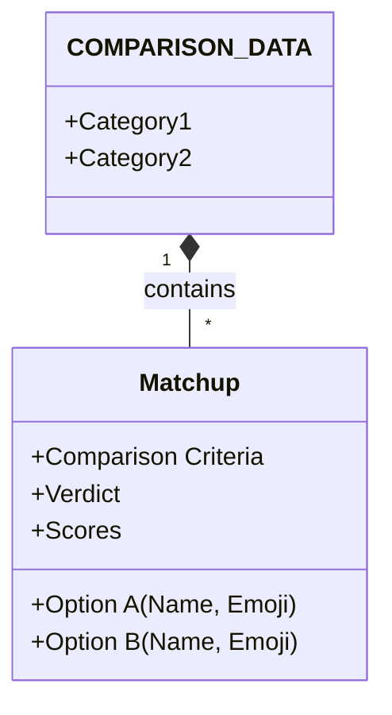

# 🤝 Contributing to The Tech Referee

Thank you for your interest in improving The Tech Referee! We believe the best decisions come from diverse experiences, so we welcome new matchups and categories.

## 🧠 How It Works

The entire application drives off a single Python dictionary called `COMPARISON_DATA` in `app.py`. There is no complex database migration required—just edit the dictionary!

### Data Structure



## 📝 How to Add a New Matchup

To add a comparison (e.g., *FastAPI vs Flask*), follow these steps:

### 1. Locate the Data
Open `app.py` and find the `COMPARISON_DATA` variable (lines 5-102).

### 2. Insert Your Entry
Add a new key under the appropriate category. If the category doesn't exist, create it!

```python
'Web Frameworks': {
    'FastAPI vs Flask': {
        'option_a': {'name': 'FastAPI', 'emoji': '🚀'},
        'option_b': {'name': 'Flask', 'emoji': '🧪'},

        'comparison': {
            'Performance': ['High (Starlette)', 'Standard (WSGI)'],
            'Async Support': ['Native', 'Add-on required']
            # Add 2-4 key comparison points
        },

        'verdict': {
            'option_a_scenario': "Choose FastAPI for modern, high-performance APIs.",
            'option_b_scenario': "Choose Flask for simple apps and quick prototyping."
        },

        'scores': {'option_a': 9, 'option_b': 8}
    }
}
```

### 3. Test It
Run the app locally to ensure your new matchup renders correctly:
```bash
streamlit run app.py
```

## ✅ Contribution Checklist

- [ ] My comparison is objective and fair (no "fanboy" language).
- [ ] I have included both "Winner Scenes" (scenarios where A or B wins).
- [ ] I have used appropriate emojis for the options.
- [ ] The code is valid Python syntax (watch those commas!).

---
**Questions?** Open an issue and ask!
