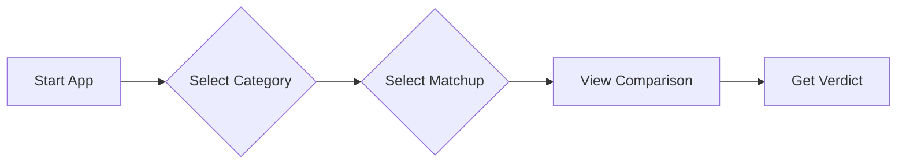

# 📘 User Guide: The Tech Referee


Welcome to **The Tech Referee**, your personal assistant for making tough technical decisions. Stop arguing about "React vs Vue" in meetings—let the referee decide based on facts!

---

## 🚀 Getting Started

### Prerequisites
*   Python 3.7 or higher
*   pip (Python package manager)

### Installation

1.  Clone the repository to your local machine:
    ```bash
    git clone https://github.com/your-username/the-cloud-referee.git
    cd the-cloud-referee
    ```

2.  Install the required dependencies:
    ```bash
    pip install streamlit pandas
    ```

---

## 🥊 How to Use the Referee

Follow this simple flow to get your verdict:



### Step 1: Enter the Ring
Run the application from your terminal:
```bash
streamlit run app.py
```
A new tab will open in your browser (usually at `http://localhost:8501`).

### Step 2: Configure the Match
Look at the **Left Sidebar**. This is your control center.
1.  **Category**: Choose the domain (e.g., *Cloud Compute*, *Database*).
2.  **Matchup**: Choose the specific fighters (e.g., *AWS Lambda vs EC2*).

### Step 3: Analyze the Head-to-Head
The main screen will update instantly.
*   **Identities**: See the contenders with their icons.
*   **Comparison Matrix**: A side-by-side table comparing Cost, Scalability, and more.

### Step 4: Accept the Verdict
Scroll down to "The Final Verdict".
*   **Green Box**: Read this to see when Option A is the winner.
*   **Blue Box**: Read this to see when Option B is the winner.
*   **Scorecard**: Check the Developer Experience (DX) score to see which one is easier to work with.

---

## 💡 Pro Tips

> [!TIP]
> **Don't just look at the score!**
> A technology might have a lower "Dev Score" but be the *only* valid choice for your specific constraint (e.g., strict relational data requirements).

> [!NOTE]
> **Updates happen Live**
> You can switch matchups instantly without refreshing the page. The Referee is always ready for the next fight.

---
*Happy Coding!* 🥋
